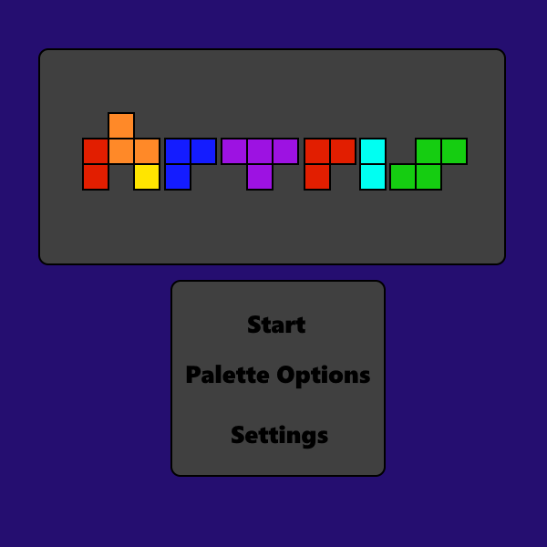
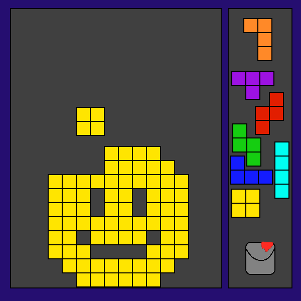

<h1>Artris</h1>

     The game of Tetris, but the puzzle is your own creativity.

        
<h2>Categories</h2>
        
<ul>
    <li>Genres: Puzzle, Sandbox, Creative</li>
    <li>Platform: Desktop Only</li>
    <li>Graphics: Retro</li>
    <li>Sound: 8-bit/Ambient</li>
    <li>Controls: Keyboard and/or Mouse</li>
</ul>

<h2>Theme</h2>

    The theme of this game is player-driven creativity. Given a familiar screen, infinite time, and flexible and
    easy-to-use tools, what kinds of masterpieces could a player think to create?

<h2>Gameplay</h2>

    The player will be able to select the Tetromino of their choice (as well as be able to choose the color for
    that piece) with the mouse, and it will be launched into the game screen, where it will slowly fall down to
    the bottom. The player can press the arrow keys to move that piece to the left or right, make it drop
    faster, or make it instantly snap to the bottom, and press x and z to turn it clockwise and
    counter-clockwise, respectively. Once the piece has been placed, the player can then select a new piece from
    the right side of the screen again. Just like in tetris, once a row is completely filled up, it will
    disappear. The point of the game, however, is not to make rows disappear. Instead, it is for the player to
    carefully consider how they must place the pieces in order to make something, whether it's a picture of an
    8-bit Italian plumber, a little smiley face, or a custom rendition of the Mona Lisa!

<h2>Screenshots</h2>

    
    

<h2>Other Comments</h2>

    If time allows, it would also be interesting to create an online gallery for people to upload
    their creations for others to see, and even have a simple rating system.

<h2>About the developer</h2>

    I'm Andrew Heater, a second year Game Design student at RIT. When I'm not playing games with friends or
    making them, I'm usually singing in my a capella group. I love learning all sorts of new technologies, and
    being able to make something I feel proud of. Right now, I know how to use C#, Java, HTML, CSS, and have
    dabbled in a few other languages, and I'm learning how to make projects in Maya, Unity, and the Unreal
    Engine.

